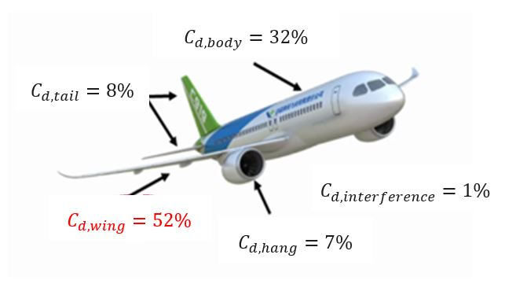
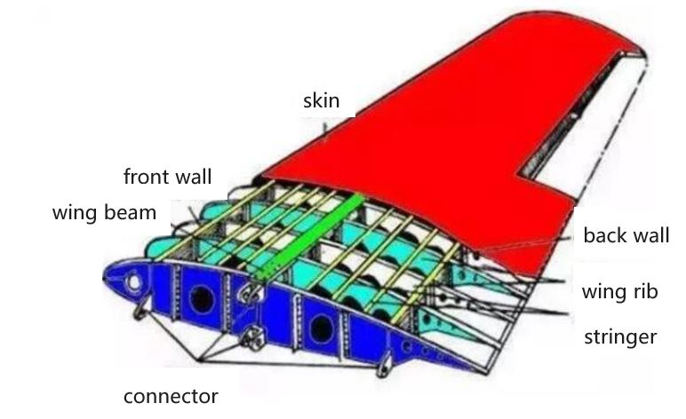
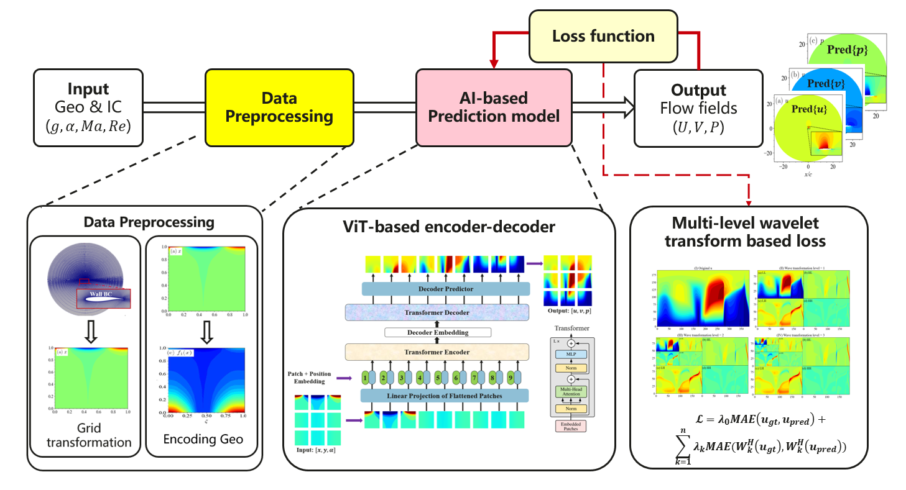

# msflow_test

## **Introduction**

**DongFang·YuFeng** built based on Ascend AI, is an efficient and high-accuracy AI simulation model for forecasting flow fields over airfoils of the airliner. With the support of MindSpore, the ability to simulate complex flows has been effectively improved. The simulation time is shortened to 1/24 of that in traditional Computational Fluid Dynamics (CFD) and the number of wind tunnel tests is reduced.Additionally, "DongFang·YuFeng"  is capable of predicting the areas with sharp changes in the flow field accurately, and the averaged error of the whole flow field can be reduced to 1e-4 magnitude, reaching the industrial standard.

This tutorial will introduce the research background and technical path of "DongFang·YuFeng" and show how to use MindSpore Flow to realize the training and fast inference of the model, as well as visualized analysis of the flow field, so as to quickly obtain the physical information of the flow field.

## **Background**

Civil aircraft aerodynamic design level directly determines the "four characteristics" of aircraft, namely safety, comfort, economy and environmental protection. Aerodynamic design of aircraft, as one of the most basic and core technologies in aircraft design, has different research needs and priorities in different stages of aircraft flight envelope (take-off, climb, cruise, descent, landing, etc.). For example, in the take-off phase, engineers will focus more on external noise and high lift-drag ratio, while in the cruise phase they will focus on fuel and energy efficiency. The flow simulation technology is widely used in aircraft aerodynamic design. Its main purpose is to obtain the flow field characteristics (velocity, pressure, etc.) of the simulation target through numerical methods, and then analyze the aerodynamic performance parameters of the aircraft, so as to achieve the optimization design of the aerodynamic performance of the aircraft.

Currently, the aerodynamic simulation of aircraft usually uses commercial simulation software to solve the governing equations and obtain the corresponding aerodynamic performance parameters (lift and drag, pressure, velocity, etc.). However, regardless of the CFD-based simulation software, the following steps are involved:

1. Physical modeling. The physical problems are abstracted and simplified to model the 2D/3D fluid and solid computational domain of the related geometry.
2. Mesh partition. The computing domain is divided into face/volume units of corresponding size to resolve turbulence in different areas and different scales.
3. Numerical discretization. The integral, differential and partial derivative terms in the governing equation are discretized into algebraic form through different order numerical formats to form corresponding algebraic equations.
4. Solution of governing equation. Use the numerical methods (such as `SIMPLE`, `PISO` etc.) to solve the discrete governing equations iteratively, and calculate the numerical solutions at discrete time/space points.
5. Post-processing. After the solution, use the flow field post-processing software to conduct qualitative and quantitative analysis and visualization of the simulation results and verify the accuracy of the results.

However, with the shortening of aircraft design and development cycle, the existing aerodynamic design methods have many limitations. Thus, in order to make the aerodynamic design level of airliner catch up with the two major aviation giants, Boeing and Airbus, it is necessary to develop advanced aerodynamic design means and combine advanced technologies such as artificial intelligence to establish fast aerodynamic design tools suitable for model design, thereby improving its simulation capability for complex flows and reducing the number of wind tunnel tests, as well as reducing design and research and development costs.

In the design of aircraft, the drag distribution of the wing is about 52% of the overall flight drag. Therefore, the wing shape design is very important for the whole flight performance of the aircraft. However, the high-fidelity CFD simulation of 3D wing requires millions of computational grids, which consumes a lot of computational resources and takes a long computational cycle. To improve the efficiency of simulation design, the design optimization of the two-dimensional section of the 3D wing is usually carried out first, and this process often requires repeated iterative CFD calculation for thousands of pairs of airfoils and their corresponding working conditions. Among these airfoils, the supercritical airfoil has an important application in high-speed cruise. Compared with the common airfoil, the supercritical airfoil has a fuller head, which reduces the peak negative pressure at the leading edge, and makes the airflow reach the sound velocity later, i.e. the critical Mach number is increased. At the same time, the middle of the upper surface of supercritical airfoil is relatively flat, which effectively controls the further acceleration of the upper airfoil airflow, reduces the intensity and influence range of the shock wave, and delays the shock-induced boundary layer separation on the upper surface. Therefore, supercritical airfoils with higher critical Mach numbers must be considered in wing shapes, since they  can significantly improve aerodynamic performance in the transonic range, reduce drag and improve attitude controllability.

However, the aerodynamic design of two-dimensional supercritical airfoils needs to be simulated for different shapes and inflow parameters, and there are still a lot of iterative computations, which result in a long design cycle. Therefore, it is particularly important to use  AI's natural parallel inference capabilities to shorten the research and development cycle. Based on this, COMAC and Huawei jointly released the industry's first AI industrial flow simulation model -- **"DongFang·YuFeng"**, which can detect changes in the geometry and flow parameters (angle of attack/Mach number) of the supercritical airfoil. The high-efficiency and high-precision inference of airfoil flow field of airliner is realized, and the flow field around airfoil and lift drag are predicted quickly and accurately.

## **Technical difficulties**

In order to realize high-efficiency and high-precision flow field prediction of supercritical airfoil by AI, the following technical difficulties need to be overcome:

* **Airfoil meshes are uneven and flow feature extraction is difficult.** O-type or C-type meshes are often used for fluid simulation of 2D airfoil computing domain. As shown in the figure, a typical O-shaped mesh is divided. In order to accurately calculate the flow boundary layer, the near-wall surface of the airfoil is meshed, while the far-field mesh is relatively sparse. This non-standard grid data structure increases the difficulty of extracting flow features.

    

    

* **Flow characteristics change significantly when different aerodynamic parameters or airfoil shapes change.** As shown in the figure, when the angle of attack of the airfoil changes, the flow field will change dramatically, especially when the angle of attack increases to a certain degree, shock wave phenomenon will occur: that is, there is obvious discontinuity in the flow field. The pressure, velocity and density of the fluid on the wavefront are obviously changed abruptly.

    

* **The flow field in the shock region changes dramatically, and it is difficult to predict.** Because the existence of shock wave has a significant impact on the flow field nearby, the flow field before and after shock wave changes dramatically, and the flow field changes are complex, making it difficult for AI to predict. The location of shock wave directly affects the aerodynamic performance design and load distribution of airfoil. Therefore, accurate capture of shock signals is very important but challenging.

## **Technical Path**

Aiming at the technical difficulties mentioned above, we designed an AI model-based technology roadmap to construct the end-to-end mapping of airfoil geometry and its corresponding flow fields under different flow states, which mainly includes the following core steps:

* First, we design an efficient AI data conversion tool to realize feature extraction of complex boundary and non-standard data of airfoil flow field, as shown in the data preprocessing module. Firstly, the regularized AI tensor data is generated by the grid conversion program of curvilinear coordinate system, and then the geometric coding method is used to enhance the extraction of complex geometric boundary features.

* Secondly, the neural network model is used to map the airfoil configuration and the physical parameters of the flow field under different flow states, as shown in Figure ViT-based encoder-decoder. The input of the model is airfoil geometry information and aerodynamic parameters generated after coordinate transformation. The output of the model is the physical information of the flow field, such as velocity and pressure.

* Finally, the weights of the network are trained using the multilevel wavelet transform loss function. Perform further decomposition and learning on abrupt high-frequency signals in the flow field, so as to improve prediction accuracy of areas (such as shock waves) that change sharply in the flow field, as shown in a module corresponding to the loss function.

